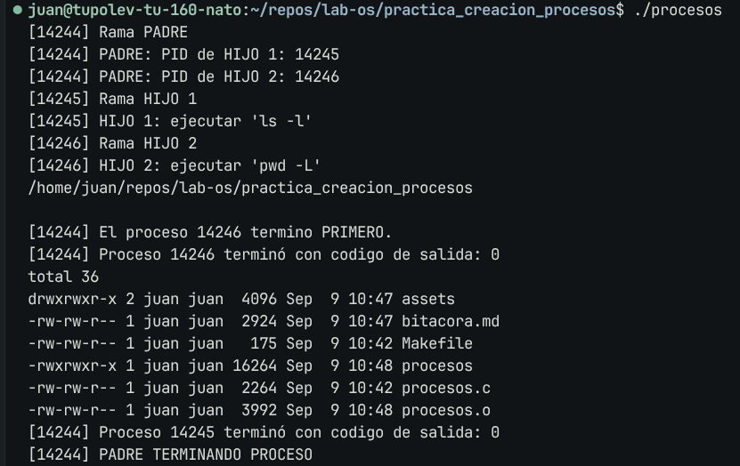

# Bitacora de desarrollo - Taller creacion de procesos

Documentacion de la practica de laboratorio.

##  Integrantes
- Juan Jose Rodriguez Prada <juarodriguezkq@unicauca.edu.co>
- Sebastian Tintinago Pantoja <sebastiantintinago@unicauca.edu.co>
---

## Preparacion

Se creo un programa en `C` que permitiera al proceso padre crear dos procesos hijos identicos con la ayuda del `fork`, y ejecutar en cada hijo una instruccion diferente mediante `exec`.

Asi mismo, se mostro en cada proceso la informacion de cada operacion que se realizara. Al final se informo cual proceso termino primero.

```c
/**
 * @file
 * @brief Crear dos procesos que ejecuten diferentes comandos, y verificar cual termina primero.
 * @authors Juan Jose Rodriguez Prada <juanrodriguezkq@unicauca.edu.co>
 *          Sebastian Tintinago Pantoja <sebastiantintinago@unicauca.edu.co>
 */

#include <stdio.h>
#include <stdlib.h>
#include <unistd.h>
#include <sys/types.h>
#include <sys/wait.h>

int main()
{
    pid_t pid = fork();
    switch (pid)
    {
    case -1:
        perror("Error al duplicar proceso...");
        exit(EXIT_FAILURE);
    case 0:
        printf("[%d] Rama HIJO 1\n", getpid());
        printf("[%d] HIJO 1: ejecutar 'ls -l'\n", getpid());

        execlp("ls", "ls", "-l", (char *)NULL);

        perror("Error al usar exec en hijo 1");
        exit(EXIT_FAILURE);

    default:
        printf("[%d] Rama PADRE\n", getpid());
        printf("[%d] PADRE: PID de HIJO 1: %d\n", getpid(), pid);

        pid_t pid_1 = fork();

        switch (pid_1)
        {
        case -1:
            perror("Error al clonar segundo hijo...");
            exit(EXIT_FAILURE);

        case 0:
            printf("[%d] Rama HIJO 2\n", getpid());
            printf("[%d] HIJO 2: ejecutar 'pwd -L'\n", getpid());

            execlp("pwd", "pwd", "-L", (char *)NULL);

            perror("Error al usar exec en hijo 2");
            exit(EXIT_FAILURE);

        default:
            printf("[%d] PADRE: PID de HIJO 2: %d\n", getpid(), pid_1);

            for (int i = 0; i < 2; i++)
            {
                int estado;
                pid_t wpid = waitpid(-1, &estado, 0);

                if (wpid < 0)
                {
                    perror("Error al esperar por el proceso");
                    exit(EXIT_FAILURE);
                }

                if (WIFEXITED(estado))
                {
                    if (i == 0)
                    {
                        printf("\n[%d] El proceso %d termino PRIMERO.\n", getpid(), wpid);
                    }
                    printf("[%d] Proceso %d terminó con codigo de salida: %d\n",
                           getpid(), wpid, WEXITSTATUS(estado));
                }
            }

            printf("[%d] PADRE TERMINANDO PROCESO\n", getpid());
            break;
        }
    }

    exit(EXIT_SUCCESS);
}
```

Como resultado de la ejecucion se obtuvo lo siguiente:



## Explicacion punto 3

Uno de los requisitos solicitados para el programa fue:

> Añadir código después de la llamada a exec. Ejecutar el programa y
explicar en la bitácora por qué ese código no se ejecuta, y en qué caso sí lo haría.

En el caso del programa realizado, estas lineas de codigo se encuentran en: 

```c
// ...
// RAMA HIJO 1
case 0:
        printf("[%d] Rama HIJO 1\n", getpid());
        printf("[%d] HIJO 1: ejecutar 'ls -l'\n", getpid());

        execlp("ls", "ls", "-l", (char *)NULL);

        perror("Error al usar exec en hijo 1");
        exit(EXIT_FAILURE);
// ...
```

Y tambien en:

```c
// ...
// RAMA HIJO 2
case 0:
            printf("[%d] Rama HIJO 2\n", getpid());
            printf("[%d] HIJO 2: ejecutar 'pwd -L'\n", getpid());

            execlp("pwd", "pwd", "-L", (char *)NULL);

            perror("Error al usar exec en hijo 2");
            exit(EXIT_FAILURE);
// ...
```

En general, las lineas de codigo despues del llamado a `exec()` no se ejecutaran ya que dicha llamada reemplaza la imagen del proceso desde donde es llamada, por el proceso que se le indico ejecutar, lo que termina cualquier flujo que este despues de esta llamada en caso tal de que no suceda un error.

Las lineas inferiores a la llamada se ejecutaran en caso de que `exec()` no pueda realizar el reemplazo, por ejemplo, si se solicita ejecutar un comando que requiera permisos adicionales o si el proceso solicitado no existe. En tal caso, `exec()` retorna al proceso que lo llamo y continua el flujo desde alli.