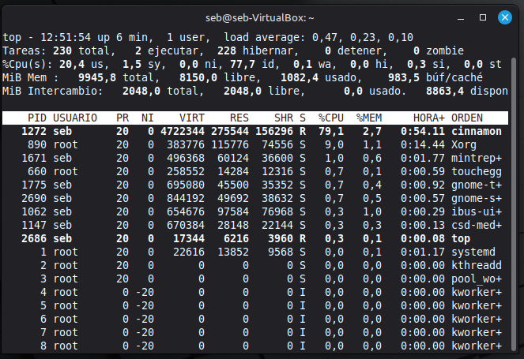
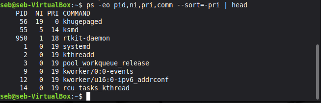
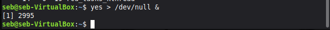
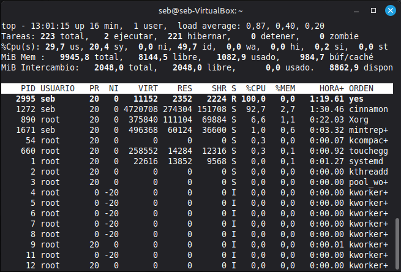
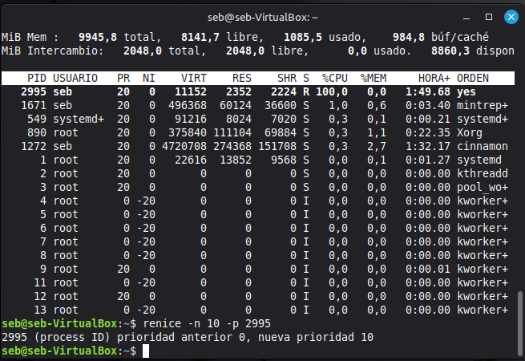
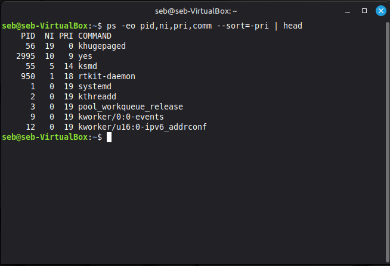

# Bitacora de desarrollo - Taller Planificacion de Procesos

Documentacion de la practica de laboratorio.

##  Integrantes
- Juan Jose Rodriguez Prada <juarodriguezkq@unicauca.edu.co>
- Sebastian Tintinago Pantoja <sebastiantintinago@unicauca.edu.co>
---
##  Preparacion

##  Segunda parte: 

El primero paso es lanzar el comando top en la terminal para asi visualizar los procesos que estan corriendo.

Observamos los procesos en ejecucion y sus prioridades.

Procedemos a lanzar un proceso que consuma procesador de forma sostenida, el cual nos da un PID que se usara mas adelante

Volvemos a realizar el comando top para verificar que el proceso esta activo y consumiendo recursos 

Lanzamos el comando renice que nos permite cambiar su valor de amabilidad durante la ejecucion, donde cede mas el procesador 

Como podemos evidenciar haciendo uso del comando '$ ps -eo pid,ni,pri,comm --sort=-pri | head' se verifica el cambio

¿Que cambia? y ¿que no?

La columna del valor N refleja un cambio instantaneo, lo que no cambia de una manera tan radical es que el equipo al no estar con tantos procesos pidiendo el CPU de manera simultanea, el porcentaje que se consume asi se haya lanzado el proceso puede seguir viendose normal, niceness se ve mas evidenciado con muchos mas procesos en simultaneo compitiendo por el mismo nucleo.

