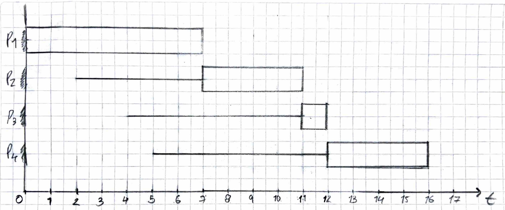
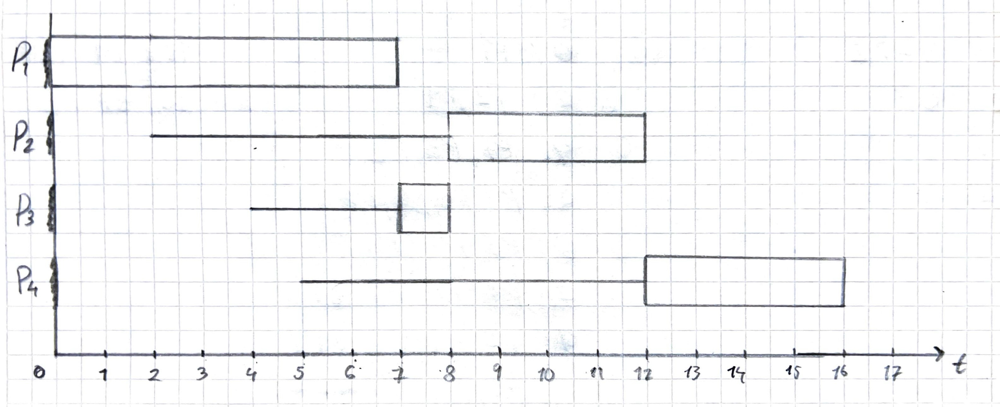
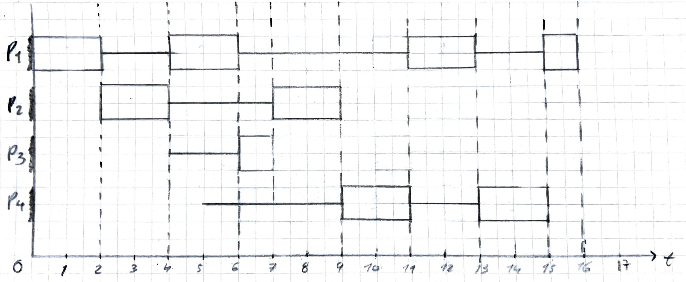
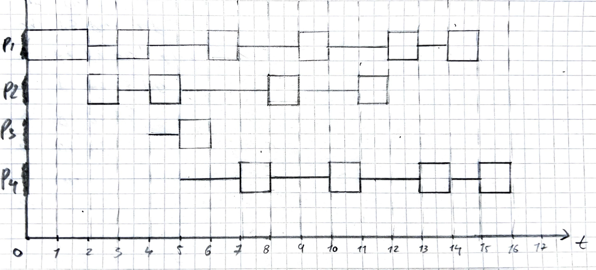
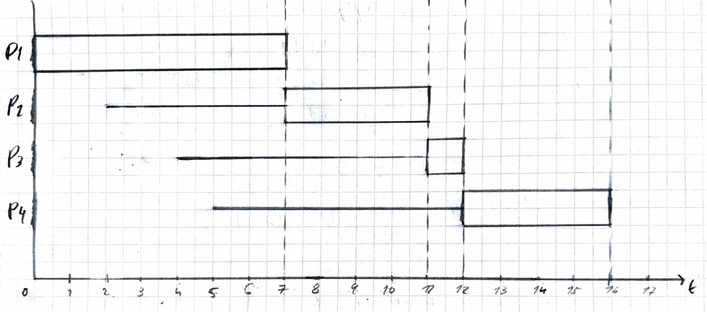

# Bitacora de desarrollo - Taller planificacion de procesos

Documentacion de la practica de laboratorio.

##  Integrantes
- Juan Jose Rodriguez Prada <juarodriguezkq@unicauca.edu.co>
- Sebastian Tintinago Pantoja <sebastiantintinago@unicauca.edu.co>
---

## Parte 1

Se trabajo en base al conjunto de procesos: 

| Proceso | Llegada | Ráfaga |
|---------|---------|--------|
| P1      | 0       | 7      |
| P2      | 2       | 4      |
| P3      | 4       | 1      |
| P4      | 5       | 4      |

Se realizo la planificacion y el diagrama de Gantt de cada algoritmo solicitado. Ademas, se calculo para cada algoritmo su tabla de tiempos. 

En los diagramas de Gantt se represento el tiempo de espera con una linea delgada y el tiempo de ejecucion con un rectangulo.

### 1. FIFO (First In, First Out)

Representado el estado de los procesos, siguiendo el algoritmo **FIFO**, se obtuvo el siguiente diagrama de Gantt:

A continuacion se calculo la tabla de tiempos.

| **Proceso** | **Tiempo de espera** | **Tiempo de ejecucion** | **Tiempo de retorno** |
|:-----------:|:--------------------:|:-----------------------:|:---------------------:|
| P1          | 0                    | 7                       | 7                     |
| P2          | 5                    | 4                       | 9                     |
| P3          | 7                    | 1                       | 8                     |
| P4          | 7                    | 4                       | 11                    |
| **Promedio**    | 4,75                 | 4                       | 8,75                  |

### 2. SJF (Shortest Job First)

Representado el estado de los procesos, siguiendo el algoritmo **SJF**, se obtuvo el siguiente diagrama de Gantt:

A continuacion se calculo la tabla de tiempos.

| **Proceso** | **Tiempo de espera** | **Tiempo de ejecucion** | **Tiempo de retorno** |
|:-----------:|:--------------------:|:-----------------------:|:---------------------:|
| P1          | 0                    | 7                       | 7                     |
| P2          | 6                    | 4                       | 10                    |
| P3          | 3                    | 1                       | 4                     |
| P4          | 7                    | 4                       | 11                    |
| **Promedio**    | 4                    | 4                       | 8                     |

### 3. Round Robin

Representado el estado de los procesos, siguiendo el algoritmo **Round Robin**, con `Quantum = 2` se obtuvo el siguiente diagrama de Gantt:

A continuacion se calculo la tabla de tiempos.

| **Proceso** | **Tiempo de espera** | **Tiempo de ejecucion** | **Tiempo de retorno** |
|:-----------:|:--------------------:|:-----------------------:|:---------------------:|
| P1          | 9                    | 7                       | 16                    |
| P2          | 3                    | 4                       | 7                     |
| P3          | 2                    | 1                       | 3                     |
| P4          | 6                    | 4                       | 10                    |
| **Promedio**    | 5                    | 4                       | 9                     |

## 4. Comparacion de resultados

Tras evaluar las tablas de tiempos se obtuvieron los siguientes resultados:

| **Algoritmo**            | **Tiempo de espera promedio (unidades de tiempo)** | **Tiempo de ejecucion promedio (unidades de tiempo)** | **Tiempo de retorno promedio (unidades de tiempo)** |
|:------------------------:|:--------------------------------------------------:|:-----------------------------------------------------:|:---------------------------------------------------:|
| FIFO                     | 4,75                                               | 4                                                     | 8,75                                                |
| SJF                      | 4                                                  | 4                                                     | 8                                                   |
| Roun Robin (Quantum = 2) | 5                                                  | 4                                                     | 9                                                   |

Segun los resultados, el algoritmo de planificacion que ofrece un menor tiempo de espera frente a los demas es `SJF`, con un promedio de 4 unidades de tiempo.

Se planteo la pregunta de que si dicho algoritmo seria optimo para una aplicacion en un sistema real. La respuesta es que no, ya que una de las mayores desventajas de este algoritmo es el riesgo de provocar una inanicion *(process starvation en ingles)* a procesos que requieran mas tiempo de ejecucion para ser completados, debido a que el sistema priorizara los procesos con un tiempo de ejecucion mas corto.

## 5. Comportamiento del algoritmo Round Robin con diferentes valores de Quantum.

Se solicito repetir el trabajo sobre el algoritmo Round Robin, esta vez utilizando diferentes valores para el quantum

### Para `Quantum = 1`
Representado el estado de los procesos, siguiendo el algoritmo **Round Robin**, con `Quantum = 1` se obtuvo el siguiente diagrama de Gantt:

Asi mismo, se realizo la tabla de tiempos:

| **Proceso** | **Tiempo de espera** | **Tiempo de ejecucion** | **Tiempo de retorno** |
|:-----------:|:--------------------:|:-----------------------:|:---------------------:|
| P1          | 8                    | 7                       | 15                    |
| P2          | 6                    | 4                       | 10                    |
| P3          | 1                    | 1                       | 2                     |
| P4          | 7                    | 4                       | 11                    |
| **Promedio**    | 5,5                  | 4                       | 9,5                   |

### Para `Quantum = 8`
Representado el estado de los procesos, siguiendo el algoritmo **Round Robin**, con `Quantum = 8` se obtuvo el siguiente diagrama de Gantt:

Asi mismo, se realizo la tabla de tiempos:

| **Proceso** | **Tiempo de espera** | **Tiempo de ejecucion** | **Tiempo de retorno** |
|:-----------:|:--------------------:|:-----------------------:|:---------------------:|
| P1          | 0                    | 7                       | 7                     |
| P2          | 5                    | 4                       | 9                     |
| P3          | 7                    | 1                       | 8                     |
| P4          | 7                    | 4                       | 11                    |
| **Promedio**    | 4,75                 | 4                       | 8,75                  |

### Analisis de resultados

El resultado obtenido en el caso de Round Robin con `Quantum = 1` dio unos valores similares a los obtenidos en el caso donde el Quantum valia 2.

| **Algoritmo**            | **Tiempo de espera promedio (unidades de tiempo)** | **Tiempo de ejecucion promedio (unidades de tiempo)** | **Tiempo de retorno promedio (unidades de tiempo)** |
|:------------------------:|:--------------------------------------------------:|:-----------------------------------------------------:|:---------------------------------------------------:|
| Roun Robin (Quantum = 1) | 5,5                                                | 4                                                     | 9,5                                                 |
| Roun Robin (Quantum = 2) | 5                                                  | 4                                                     | 8,75                                                |

Sin embargo, se pudo evidenciar que el decremento del Quantum afecto negativamente los resultados de tiempo para los mismos procesos.

Tras analizar los resultados en el caso de Round Robin con `Quantum = 8`, se pudo verificar que coincide con los resultados del algoritmo `FIFO`.

| **Algoritmo**            | **Tiempo de espera promedio (unidades de tiempo)** | **Tiempo de ejecucion promedio (unidades de tiempo)** | **Tiempo de retorno promedio (unidades de tiempo)** |
|:------------------------:|:--------------------------------------------------:|:-----------------------------------------------------:|:---------------------------------------------------:|
| FIFO                     | 4,75                                               | 4                                                     | 8,75                                                |
| Roun Robin (Quantum = 8) | 4,75                                               | 4                                                     | 8,75                                                |

Esto se debe a que cuando se tiene un algoritmo Round Robin con un valor de Quantum mayor al tiempo de ejecucion de **todos** los procesos, su comportamiento es identico al del algoritmo FIFO, esto debido a que ningun proceso agotara su Quantum y por lo tanto, se completara antes de que sea expropiado de la CPU.

## Parte 2
