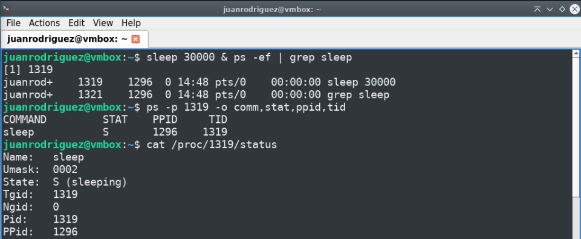
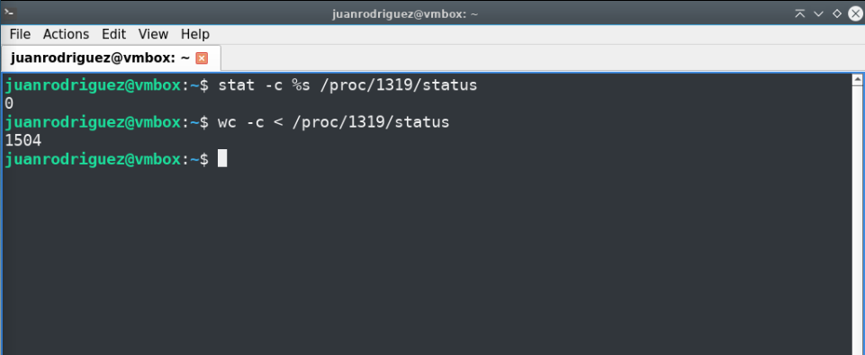
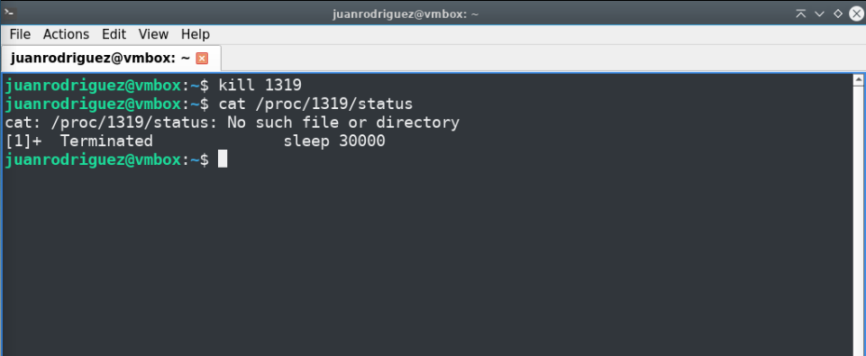
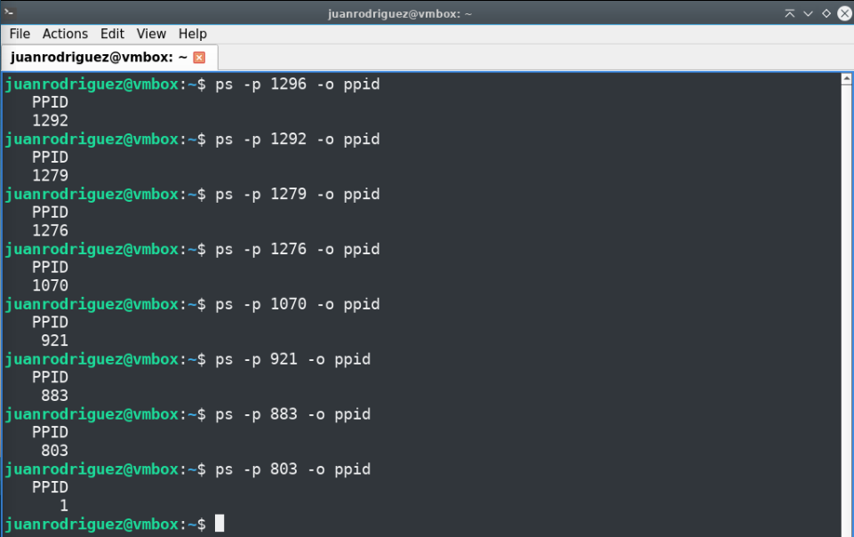
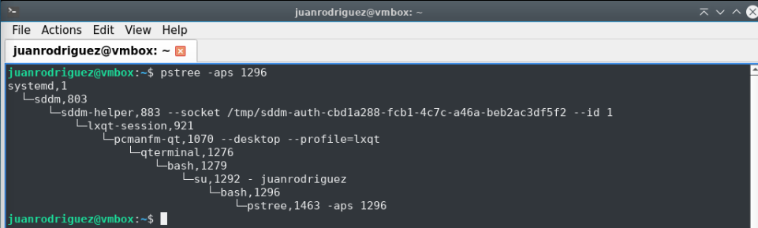

# Bitacora de desarrollo - Taller Procesos y Scripts

Documentacion de la practica de laboratorio.

##  Integrantes
- Juan Jose Rodriguez Prada <juarodriguezkq@unicauca.edu.co>
- Sebastian Tintinago Pantoja <sebastiantintinago@unicauca.edu.co>
---
##  Preparacion

##  Primera parte: Observacion desde el shell
Se lanzo un proceso propio con el proposito de localizarlo en la lista de procesos. Despues se consulto el estado de ese proceso mediante los comandos `ps` y `cat`.



Despues, se consulto el tamaño del archivo del proceso de dos maneras distintas.




Con estas dos consultas se verifico que las respuestas no coinciden. Esto se debe a que cuando se realiza el llamado al comando:
```bash
stat -c %s /proc/1319/status
```
el parametro `%s` indica que se quiere recuperar el tamaño tota en bytes del archivo. A su vez, cuando se realiza el llamado al comando:

```bash
wc -c < /proc/1319/status
```
el parametro `-c` indica que se imprima el conteo de bytes y el resto de la instruccion `< /proc/1700/status` indica que la entrada es el proceso del que se desea conocer la informacion.

Despues se termino el proceso y se comprobo que efectivamente dejase de existir.



Recordando que el `PPID` obtenido habia sido `1296`, consultamos su proceso padre, y repetimos hasta llegar al proceso 1.



Recorriendo la cadena de padres a mano se obtuvo la siguiente secuencia de procesos: 1296&rarr;1292&rarr;1279&rarr;1276&rarr;1070&rarr;921&rarr;883&rarr;803&rarr;1

Viendo el arbol de procesos desde el terminal:



Y se puede observar que el programa que corresponde al proceso 1 es `systemd`, es decir, el gestor de procesos de sistemas operativos Linux.

## Segunda parte: script de shell

Se redacto un script de shell llamado `infoproc.sh` que permitiera obtener la informacion que se mostro en el reporte de la primera parte. A este script se le debe pasar como parametro el `pid` del proceso de interes. 

Si el proceso existe, se muestra el nombre, estado, identificador de proceso padre y cantidad de hilos, y a su vez, se muestra la misma informacion para todos los procesos de la cadena hasta llegar al proceso con identificador `1`. 

En caso de que el proceso no se encuentre, el script informa al usuario y termina su ejecucion. 

Si no se pasa ningun dato como parametro, el script muestra la misma informacion unicamente para el proceso propio.

```bash
pid=$1
dir="/proc/${pid}"

if [ $# -lt 1 ]; then
    pid=0
fi

if [ "$pid" -eq 0 ]; then
    echo "Proceso [$$] (Actual)"
    echo "=============================="
    grep Name /proc/$$/status
    grep PPid /proc/$$/status
    grep State /proc/$$/status
    grep Threads /proc/$$/status
    echo "=============================="
    exit 0
fi

if [ ! -d "$dir" ]; then
    echo "No se encontró el proceso ${pid}."
    exit 1
fi

# TODO: Revisar explicacion

while [ "$pid" -ne 0 ]; do
    ppid=$(awk '/^PPid:/ {print $2}' /proc/$pid/status)
    echo "Proceso [${pid}]"
    echo "=============================="
    grep Name /proc/$pid/status
    grep PPid /proc/$pid/status
    grep State /proc/$pid/status
    grep Threads /proc/$pid/status
    echo "=============================="
    pid=$ppid
done

exit 0
```

## Tercera parte: 

