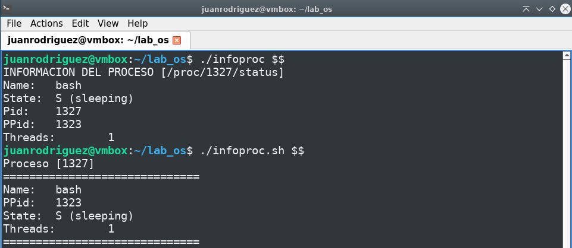
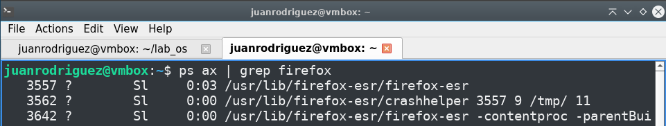

# Bitacora de desarrollo - Taller Procesos y Scripts

Documentacion de la practica de laboratorio.

##  Integrantes
- Juan Jose Rodriguez Prada <juarodriguezkq@unicauca.edu.co>
- Sebastian Tintinago Pantoja <sebastiantintinago@unicauca.edu.co>
---
##  Preparacion

##  Primera parte: Observacion desde el shell
Se lanzo un proceso propio con el proposito de localizarlo en la lista de procesos. Despues se consulto el estado de ese proceso mediante los comandos `ps` y `cat`.


Despues, se consulto el tamaño del archivo del proceso de dos maneras distintas.


Con estas dos consultas se verifico que las respuestas no coinciden. Esto se debe a que cuando se realiza el llamado al comando:
```bash
stat -c %s /proc/1319/status
```
el parametro `%s` indica que se quiere recuperar el tamaño tota en bytes del archivo. A su vez, cuando se realiza el llamado al comando:

```bash
wc -c < /proc/1319/status
```
el parametro `-c` indica que se imprima el conteo de bytes y el resto de la instruccion `< /proc/1700/status` indica que la entrada es el proceso del que se desea conocer la informacion.

Despues se termino el proceso y se comprobo que efectivamente dejase de existir.


Recordando que el `PPID` obtenido habia sido `1296`, consultamos su proceso padre, y repetimos hasta llegar al proceso 1.


Recorriendo la cadena de padres a mano se obtuvo la siguiente secuencia de procesos: 1296&rarr;1292&rarr;1279&rarr;1276&rarr;1070&rarr;921&rarr;883&rarr;803&rarr;1

Viendo el arbol de procesos desde el terminal:


Y se puede observar que el programa que corresponde al proceso 1 es `systemd`, es decir, el gestor de procesos de sistemas operativos Linux.

## Segunda parte: script de shell

Se redacto un script de shell llamado `infoproc.sh` que permitiera obtener la informacion que se mostro en el reporte de la primera parte. A este script se le debe pasar como parametro el `pid` del proceso de interes. 

Si el proceso existe, se muestra el nombre, estado, identificador de proceso padre y cantidad de hilos, y a su vez, se muestra la misma informacion para todos los procesos de la cadena hasta llegar al proceso con identificador `1`. 

En caso de que el proceso no se encuentre, el script informa al usuario y termina su ejecucion. 

Si no se pasa ningun dato como parametro, el script muestra la misma informacion unicamente para el proceso propio.

```bash
pid=$1
dir="/proc/${pid}"

if [ $# -lt 1 ]; then
    pid=0
fi

if [ "$pid" -eq 0 ]; then
    echo "Proceso [$$] (Actual)"
    echo "=============================="
    grep Name /proc/$$/status
    grep PPid /proc/$$/status
    grep State /proc/$$/status
    grep Threads /proc/$$/status
    echo "=============================="
    exit 0
fi

if [ ! -d "$dir" ]; then
    echo "No se encontró el proceso ${pid}."
    exit 1
fi

# TODO: Revisar explicacion

while [ "$pid" -ne 0 ]; do
    ppid=$(awk '/^PPid:/ {print $2}' /proc/$pid/status)
    echo "Proceso [${pid}]"
    echo "=============================="
    grep Name /proc/$pid/status
    grep PPid /proc/$pid/status
    grep State /proc/$pid/status
    grep Threads /proc/$pid/status
    echo "=============================="
    pid=$ppid
done

exit 0
```

## Tercera parte: Informe mediante llamadas al sistema con C

Se creo un programa en C llamado `infoproc.c` que imita la funcionalidad del script de shell realizado anteriormente.

```c
/**
 * @file 
 * @brief Obtener datos de un proceso mediante llamadas al sistema
 * @author Juan Jose Rodriguez Prada <juanrodriguezkq@unicauca.edu.co>
 */

#include <stdio.h>
#include <stdlib.h>
#include <fcntl.h>
#include <string.h>
#include <unistd.h>

#define MAX_PATH 512
#define MAX_BUF 4096

int info_proc(const char *ruta);

int main(int argc, char *argv[])
{
    char ruta[MAX_PATH];
    const char *pid = (argc > 1) ? argv[1] : "self";

    snprintf(ruta, sizeof(ruta), "/proc/%s/status", pid);

    return info_proc(ruta);
}

/**
 * @brief   Intenta leer el archivo correspondiente al proceso indicado, o a si mismo si no se paso ningun 
 *          parametro. Despues, separa la informacion para crear un formato de informacion del proceso.
 * @param   ruta direccion de ruta al archivo del proceso.
 * @return  -1 si no se encontro el archivo del proceso o no se pudo leer, 0 si la operacion fue exitosa. 
 */
int info_proc(const char *ruta)
{
    int fd = open(ruta, O_RDONLY);
    if (fd < 0)
    {
        perror("Error al abrir el archivo del proceso");
        return -1;
    }

    char buffer[MAX_BUF];
    ssize_t bytes = read(fd, buffer, sizeof(buffer) - 1);
    close(fd);

    if (bytes < 0)
    {
        perror("Error al leer el archivo");
        return -1;
    }

    buffer[bytes] = '\0';

    const char *keys[] = {
        "Name:",
        "State:",
        "Pid:",
        "PPid:",
        "Threads:"
    };
    size_t num_keys = sizeof(keys) / sizeof(keys[0]);

    printf("INFORMACION DEL PROCESO [%s]\n", ruta);

    for (size_t i = 0; i < num_keys; i++)
    {
        char *pos = strstr(buffer, keys[i]);
        if (pos != NULL)
        {
            char *end = strchr(pos, '\n');
            if (end != NULL)
            {
                printf("%.*s\n", (int)(end - pos), pos);
            }
            else
            {
                printf("%s\n", pos);
            }
        }
    }

    return 0;
}
```

## Cuarta parte: Script vs C

Se compararon los comportamientos de los dos programas que estabamos trabajando, `infoproc.sh` e `infoproc.c`. Para esto, se ejecutaron las siguientes instrucciones desde la misma terminal:



Ambos archivos tuvieron como parametro `$$`, es decir, la terminal de comandos desde el cual fueron ejecutados.

Se puede evidenciar que la informacion es exactamente la misma. Este resultado es de esperarse, pues aunque sean dos ejecuciones muy diferentes, los dos programas basan su logica en leer el archivo `/proc/pid/status`. Es por esto que ambos arrojan la misma informacion.

Despues, se ejecuto nuevamente los dos programas, pero esta vez sobre un proceso que pudiera cambiar de estado, como el navegador firefox. Para encontrar el identificador del proceso se realizo la siguiente ejecucion:



Una vez detectado el identificador del navegador, se ejecutaron los dos programas sobre este id.


Como se pudo observar, el resultado no es el mismo. Se encontro una diferencia en la informacion del proceso, donde la consulta mediante el programa en C arrojo que el proceso se encontraba en **estado de reposo** `(S)` y contaba con **102 hilos**, mientras que la consulta mediante el script arrojo que el navegador se encontraba **en estado de ejecucion** `(R)` y tenia un total de **134 hilos**. El resto de la informacion del proceso se mantuvo igual en ambas consultas.

El shell funciona como un intermediario entre el usuario y el kernel del sistema operativo, y esto lo logra interpretando las instrucciones de comandos.


1. El shell usa la llamada al sistema read() para capturar los caracteres introducidos desde el teclado.
2. Rompe la línea de texto en fragmentos (tokens), expande variables de entorno y resuelve comodines.
3. Verifica si el comando es interno o busca el archivo ejecutable en los directorios del $PATH.
4. El shell ejecuta la llamada fork() para crear un proceso hijo idéntico en memoria.
5. Si existen operadores como > o |, el hijo desvia la entrada/salida.
6. El proceso hijo ejecuta execve() para sobreescribir su memoria con el código del nuevo programa.
7. El shell padre ejecuta wait() y el sistema operativo lo suspende hasta que el hijo termine.
8. El hijo finaliza con exit() y el sistema operativo despierta al shell padre entregándole el código de salida.
9. El shell limpia su búfer, muestra de nuevo el prompt y vuelve a bloquearse en el paso 1.

## Quinta parte


